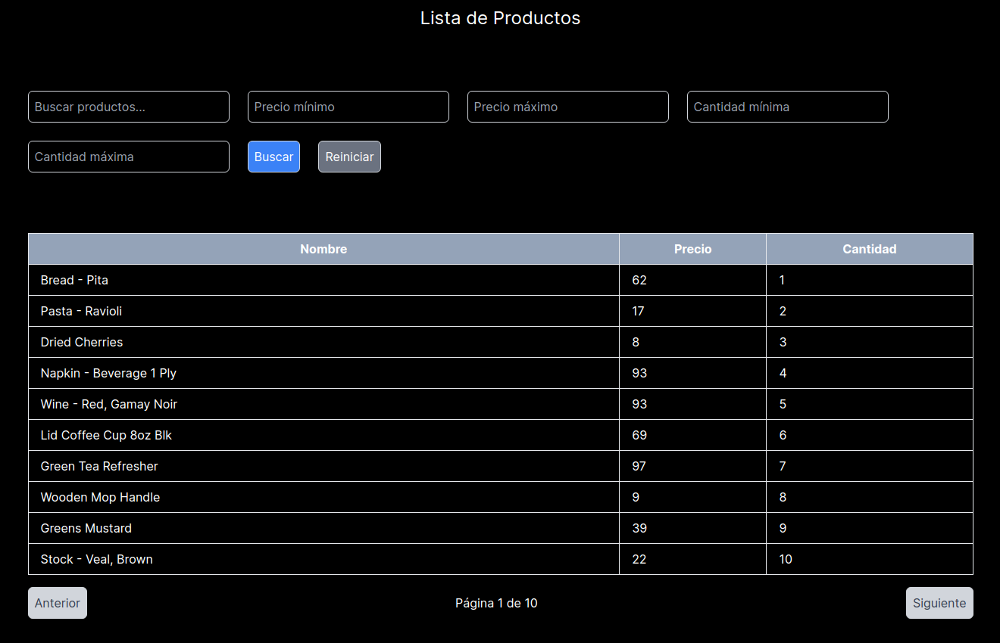

## Challenge .

Aplication to list and filter products.


## Description
Development of a simple and functional user interface application in React with Typescript. It has:

- Backend with a list of products and filters.
- Postman collection to endpoints.
- Frontend with a list of products and filters.
- Context to manage the state of the application.
- Responsive design.
- Swagger for API documentation.


## Herramientas
- Next.js
- Nest.js
- Styles: Tailwindcss

## Images




## Environment variables

For easy of use, the environment variables are already configured in the project, this is a bad practice, but for the purpose of the challenge it is enough.

Front will be in http://localhost:3000
Back will be in http://localhost:4000/products
Swagger will be in http://localhost:4000/api


## Intalacion y ejecucion

```
In both the frontend and backend folders, i am using node version 20.11.1
// Backend:
cd backend
npm install
npm run start:dev

// Frontend:
cd frontend
npm install
npm run dev
```

Another option is to use docker-compose , an only one command to run the project. This will work in the path http://localhost:3000
```
docker-compose up
```

